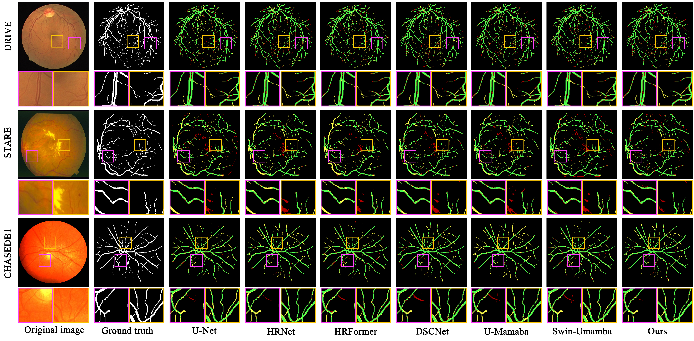
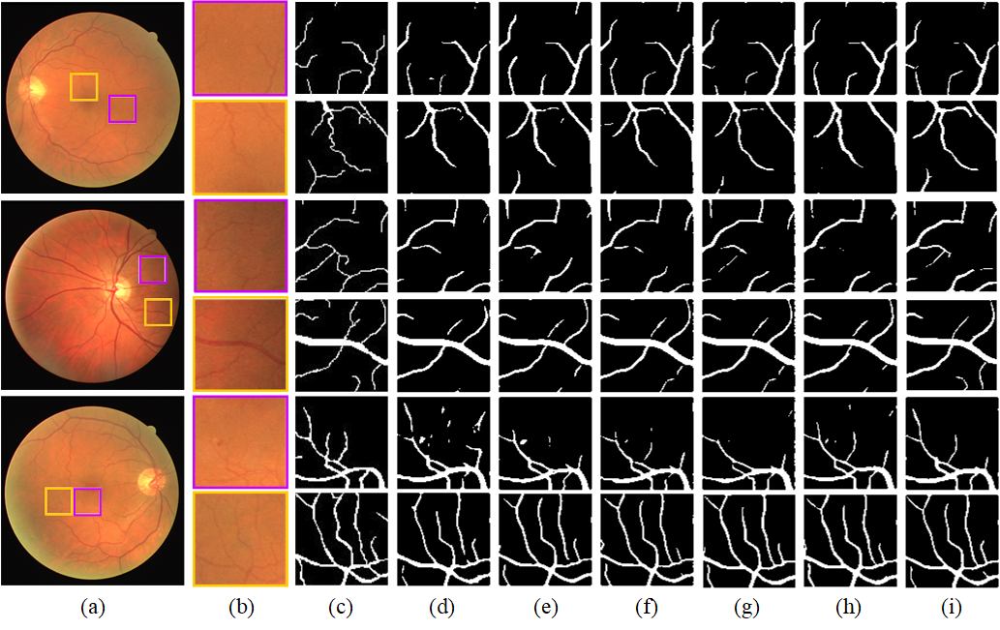
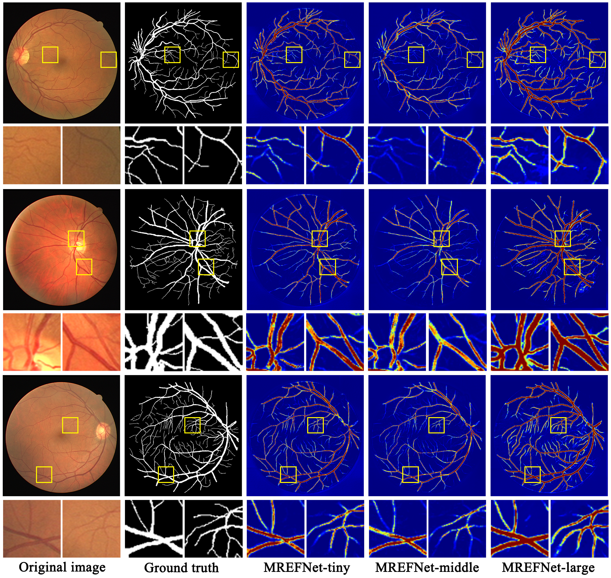

# HRFENet

A Novel Hybrid Approach for Retinal Vessel Segmentation with Dynamic Long-Range Dependency and Multi-Scale Retinal Edge Fusion Enhancement

*****

All results is evaluated on Python 3.10 with PyTorch 2.1.1+cuda118.
We only publish our test results on the DRIVE, STARE and CHASE_DB1 for now.

The implementation details of code will be updated after the paper is officially published.

# Datasets
The DRIVE, STARE and CHASE_DB1 datasets can be downloaded with:

https://drive.grand-challenge.org/

https://cecas.clemson.edu/~ahoover/stare/probing/index.html

https://www.kaggle.com/datasets/rashasarhanalharthi/chase-db1

* * *

# 🖼️ Visual Results

The following illustrations present our comparative experiments and ablation studies.

# Reference

When building our codeWe referenced the repositories as follow:

1.[HRormer](https://github.com/HRNet/HRFormer)

2.[VMamba](https://github.com/MzeroMiko/VMamba)
